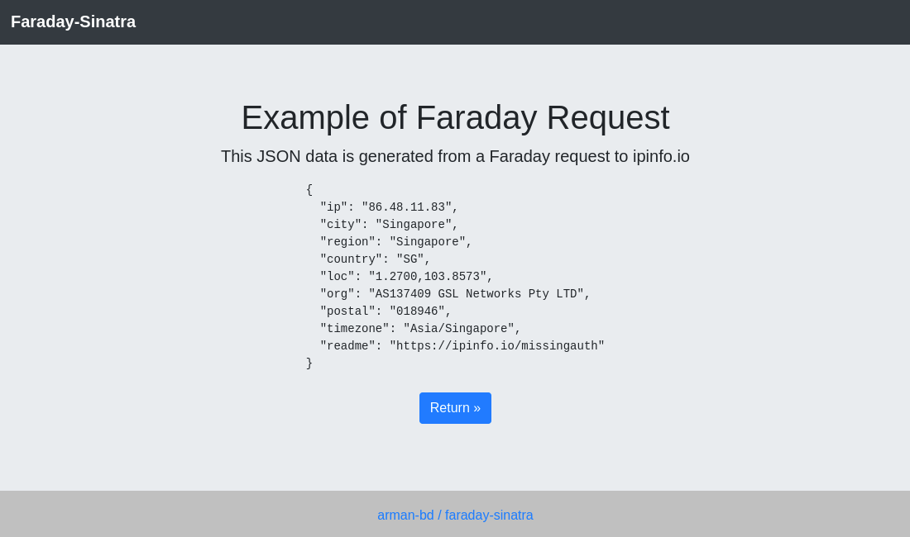

# faraday-sinatra
A simple ruby project using faraday and sinatra.

## Installation
```bash
bundle install
```

## Run
```bash
ruby src/server.rb -p 8080
```

Open `http://127.0.0.1:8080` on your browser and click on `View Info` to see `faraday` in action.


## Screenshot

